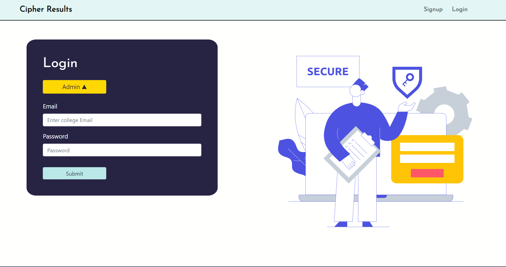
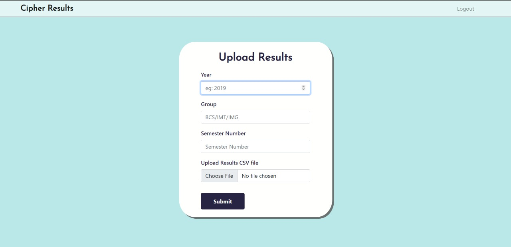
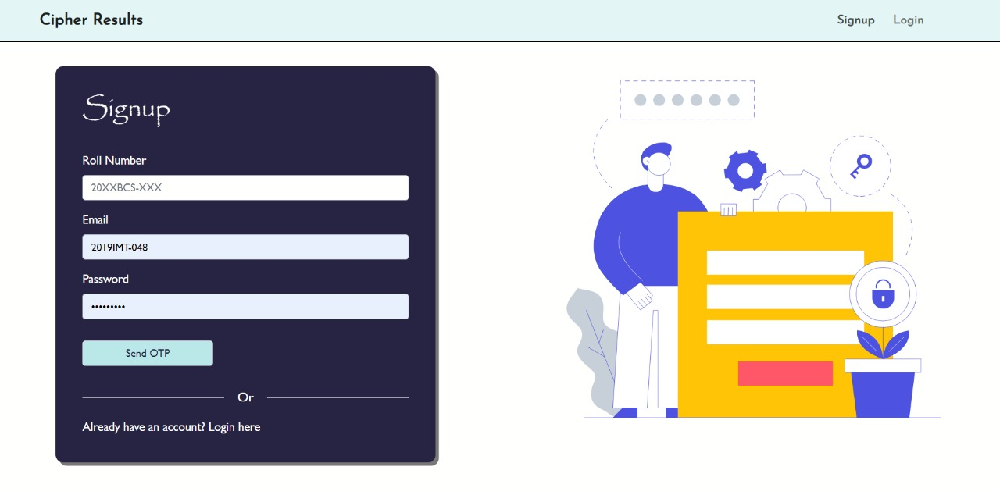
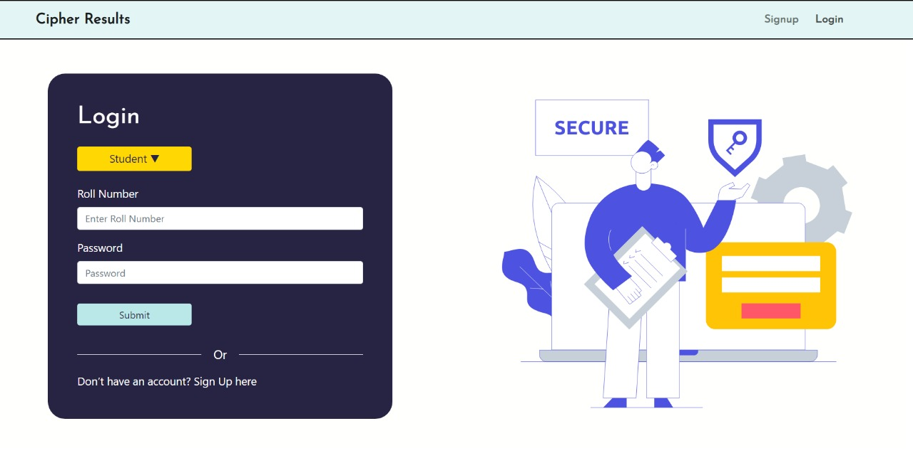
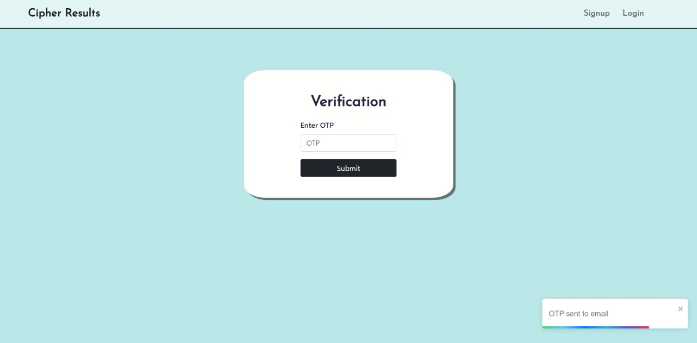
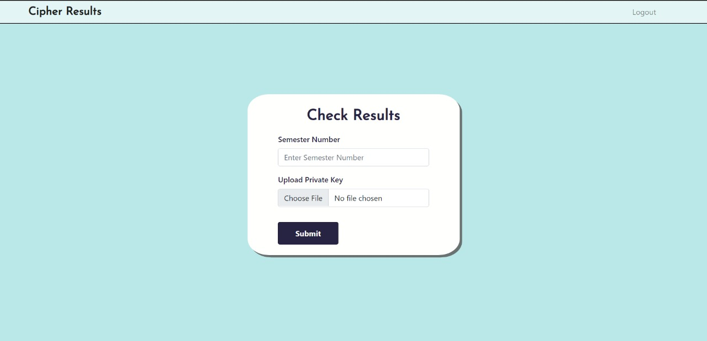

# Cipher-Results

[](#contributors-) 
[](#technologies-)
[](https://github.com/varchasv8)
[](https://github.com/MandlaGowtham)
[](https://github.com/Jithendra71)


An **Exam Results Publishing System** developed with an _Asymmetric Key Encryption_ based system to provide **confidentiality** for students.

---
# Screenshots

## Homepage
<p align="center">
    
</p>

## Admin

- ### Login
<p align="center">
    
</p>

- ### Upload Results
<p align="center">
    
    
</p>

## Student

- ### Signup and Login
<p align="center">
    
    
</p>

- ### OTP Verification Page
<p align="center">
    
</p>

- ### Check Results
<p align="center">
    
</p>

# Hosted URL

You can visit our website here [CIPHER RESULTS](https://cipher-results.herokuapp.com/)

# Description

## Problems it solves

- Posting Results publicly causes **unnecessary pressure** on students
- This project provides a medium for students to check their results of their organization.
- The motive of this project is to provide **confidentiality** to students when checking their results
- A student can view his/her results using their private key.
- We used *Asymmetric Key Encryption* to encrypt results with student's public keys.

# Features Implemented

# Frontend
<!-- ## Frontend Features -->

- Toasts for alerts, acknowledgements

### Admin
- Login
- Upload Results

### Student
- Signup & Login
- View Results

# Backend
<!-- ## Backend Features -->
- OTP Verification of Students Email
- Multer File Uploading
- Asymmetric Key Encrption of Results
- Monogodb Database

# Technologies Used
- NodeRSA
- Bcrypt
- JWT
- Multer
- NodeMailer
- React Toastify

# Local Setup

## Clone the Repo
```terminal
    git clone https://github.com/MandlaGowtham/Cipher-Results.git
```

## Install Client and Server Dependencies
- Open project directory
- Navigate to client and server directories to install the dependencies 
```shell
    # navigate to client directory
    cd client

    # install deps
    npm install

    # Then navigate back to server directory
    cd ../server

    # install deps
    npm install
```

## Run in development mode
### Forntend
```shell
    cd client

    # Run
    npm start
 ```
 ### Backend
 ```   
    cd ../server

    # Run
    npm start    
```

### Try It
* Open your browser and go to [http://localhost:3000](http://localhost:3000)


# Credits
## Team Members

- <a href="https://github.com/Jithendra71">JITHENDRA</a>
- <a href="https://github.com/MandlaGowtham">GOWTHAM</a>
- <a href="https://github.com/varchasv8">VARCHAS</a>
